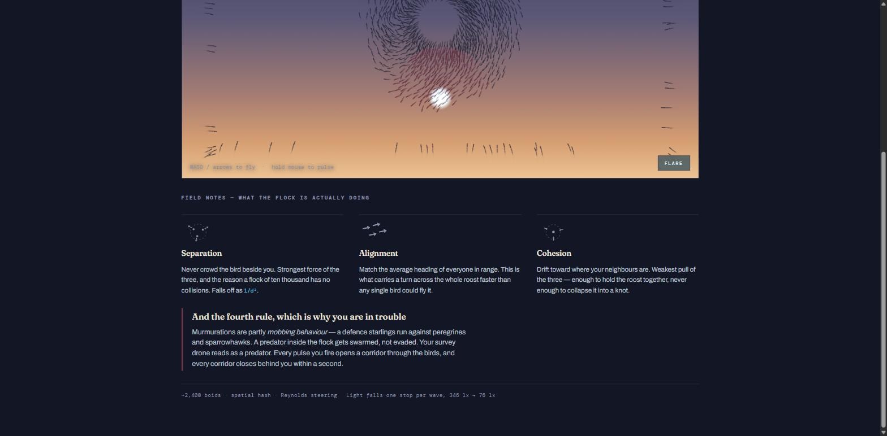

# Murmuration

A murmuration you have to survive. Single-file Canvas 2D game — no build step, no dependencies.

Starlings flock by three local rules and watch only their nearest handful of neighbours. Nobody leads. Murmurations are also partly *mobbing behaviour* — a defence real starlings run against peregrines and sparrowhawks, where a predator inside the flock gets swarmed rather than evaded. You are flying a survey drone that reads as a predator.


## Status

**Prototype.** It runs and it's playable, but it is not a finished game.

There is no level structure — a wave counter ticks every 38 seconds and raises flock size, speed and aggression while the sky darkens. There is no win condition; you can only lose. There is no audio at all.

### Correction to an earlier commit

An earlier version of this README reported a bug: frozen HUD, no projectiles, telemetry identical across captures 41 seconds apart. **That diagnosis was wrong and has been retracted.**

The captures were taken from a background browser tab. Chrome throttles `requestAnimationFrame` to near-zero when `document.hidden` is true, and the loop clamps `dt` to 50ms, so the game advanced roughly a dozen frames across those 41 seconds while the screenshot path force-painted each frame on demand. Measured directly: `visibilityState: "hidden"`, `hasFocus: false`, and a 2-second rAF loop that never completed inside a 45-second timeout.

Nothing was broken. The game only ever ran at full speed when the window was in front.

That did expose one real defect, now fixed: a backgrounded game crawled forward silently instead of stopping. It now pauses on `visibilitychange` and offers an explicit resume, and resets the frame clock on return so no time is skipped.

## Running it

No toolchain. Serve the folder over HTTP — `file://` won't work because of the font stylesheet:

```
python -m http.server 8731
```

Then open `http://127.0.0.1:8731/index.html`.

## Controls

| | |
|---|---|
| Fly | `W A S D` or arrow keys |
| Pulse | hold the mouse, aim with it |
| Flare | `Space` — shoves the whole flock, 6.5s cooldown |
| Touch | drag to fly, pulse is automatic |

## How the simulation works

Classic Reynolds steering over a spatial hash, in plain JavaScript on typed arrays.

Each bird each frame reads its neighbours out of a uniform grid — bucketed by counting sort, so the neighbour query is a 3×3 cell scan rather than a scan of the whole flock — and sums four steering forces:

- **Separation** — push away from anyone too close, falling off as `1/d²`. Strongest of the three.
- **Alignment** — match the average heading of neighbours in range. This is what carries a turn across the flock faster than any single bird flies.
- **Cohesion** — drift toward the neighbours' centroid. Weakest; enough to hold the roost together, not enough to collapse it.
- **Mobbing** — steer at the player. Weight climbs with the wave counter.

Plus a drifting **roost attractor** the flock orbits, which is what produces the large swirling shapes rather than a uniform blob, and a soft boundary force that keeps the flock in frame.



## Art direction

The obvious treatment for a boids demo is glowing particles on black. This does the opposite, because that's what a murmuration actually looks like: **dark birds against a bright dusk sky**, drawn with accumulating alpha so dense parts of the flock go near-opaque and the edges stay thin. The only artificial light in the frame is your drone, rendered additively in cold cyan against the warm sodium horizon.

Difficulty and art direction are the same variable. Each wave, dusk deepens — the sky gradient lerps toward night and the light reading falls from 346 lx to 76 lx. The bird silhouettes lighten as it goes, so they stay legible against the darkening ground.

## Performance ceiling

Roughly **2,400 birds at 60fps**. Canvas 2D means every bird crosses the CPU→GPU boundary as path segments, and the neighbour search runs on one thread.

A real murmuration is hundreds of thousands of birds. Getting there means moving the simulation into WebGPU compute shaders — agent state in storage buffers, GPU-sorted spatial bins, instanced rendering straight off the same buffer with no readback. That's a different project and it isn't started.
