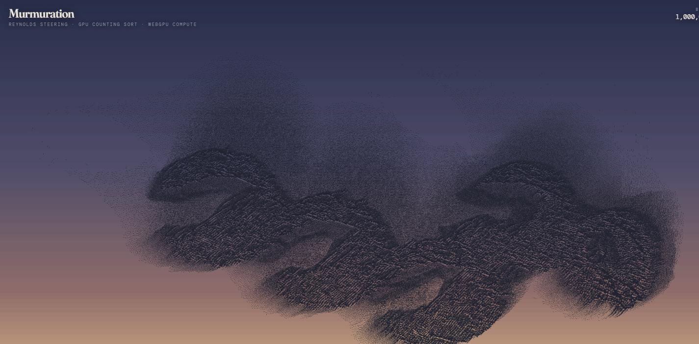
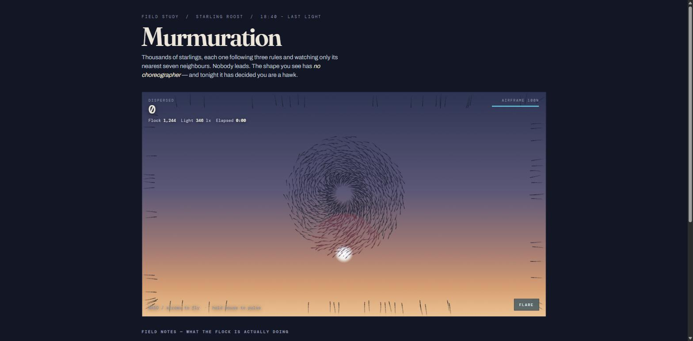

# Murmuration

A million starlings, simulated and drawn entirely on the GPU. Move the pointer into the flock and they mob it. Hold to fire a pulse and cut a corridor through them — it closes behind you within a second.



Starlings flock by three local rules, watching only their nearest handful of neighbours. Nobody leads. Murmurations are also partly *mobbing behaviour* — a defence real starlings run against peregrines and sparrowhawks, where a predator inside the flock gets swarmed rather than evaded. You read as a predator.

## Status

Playable. Fly the drone, disperse birds, survive being mobbed; waves ramp the flock and the light falls from 346 lx toward night as dusk deepens. Runs last around 25-30 seconds, which is unjudged - that is a feel question needing a foreground window.

Not yet: objectives or a win condition (you can only lose), set-pieces, and audio, of which there is none at all.

```
npm install
npm run dev
```

`/` is the live simulation. `/spike.html` is the benchmark harness that validates the spatial sort and measures readback latency.

Needs WebGPU — Chrome 113+, Edge, or Safari 18+.

## How a frame works

```
histogram          bin every bird into a uniform grid cell
scan ×2 + offsets  exclusive prefix sum over cells
scatter            agent indices into per-cell slots
reorder            gather pos/vel/alive into cell order
collide            pulse rounds and the predator hull vs birds
flock              Reynolds steering over the sorted neighbourhood
render             instanced quads straight off the same buffers
```

Nothing on that path reads back to the CPU.

**Binning is a counting sort, not a bitonic sort.** Bitonic is `O(n log²n)` — 253 passes for 4M keys. With atomics available, counting sort is `O(n)` in four dispatches. The scan is two-level, so one workgroup scans 1024 cells and emits a block total, then one workgroup scans the block totals: 1024² = 1,048,576 cells before a third level is needed.

**The reorder pass is what makes it fast.** Without it, neighbour lookups go `sortedIdx[k]` → `posIn[j]`, and that indirection scatters reads across the whole position buffer — every lane in a warp pulling a different cache line. Gathering agent data into cell order first means `offsets[]` indexes straight into the arrays and a bird's neighbours are contiguous. The scattered read happens once per agent instead of once per neighbour inspected. Worth roughly 10×.

**Pass order is load-bearing.** Collision runs between indexing and steering. The spatial index has to still describe where the birds are when collision tests them, and steering is what moves them.

**Gameplay consequences stay on the GPU.** A bird dying happens in a compute pass where the data already lives, so it is immediate. Only a 16-byte status block travels back to the CPU for the HUD, and that arrives one frame later — imperceptible on a score counter. The coarse CPU mirror originally sketched as a fallback turned out to be unnecessary.

**Agents are renumbered every frame** by the reorder. Nothing outside holds a bird's identity across frames, so that costs nothing — but it rules out per-bird state tracked by index on the CPU.

## Measured

NVIDIA Turing. Spatial sort verified by reading the whole structure back and checking it on the CPU: every agent present exactly once, every cell range holding only agents of that cell, offsets a true prefix sum of counts.

| agents | histogram | scan | scatter | total | valid |
|-------:|----------:|-----:|--------:|------:|:-----:|
| 250,000 | 0.383 ms | 0.110 ms | 0.251 ms | **0.744 ms** | ✅ |
| 1,000,000 | 0.090 ms | 0.029 ms | 0.557 ms | **0.677 ms** | ✅ |
| 4,000,000 | 1.329 ms | 0.074 ms | 5.005 ms | **6.408 ms** | ✅ |

Collision at 1M with 65 probes, paced to 60fps:

| | |
|---|---|
| collide pass | 0.066 ms |
| readback latency | **1 frame**, on 298 of 298 samples |
| wall clock | median 4.8 ms, p95 7.3 ms |
| dropped samples | 0, with a 4-deep staging ring |

Full pipeline including steering and rendering at 1M: **1.3–4.6 ms**, bimodal with GPU clock state.

4M scales superlinearly on the scatter — 9× cost for 4× agents — from a ~76 MB working set against a few MB of L2, plus a synthetic distribution far denser than a real flock. If that matters later, the fix is workgroup-local privatised counters to cut atomic contention.

## Art direction

The obvious treatment for a boids demo is glowing particles on black. This does the opposite, because it is what a murmuration actually looks like: **dark ink against a bright dusk sky**, alpha-blended so dense regions accumulate toward opaque while thin edges stay translucent. That density gradient is not a lighting effect — it is just overlap. The only artificial light in the frame is you.

Each bird is an instanced quad swept backwards along its velocity into a tapered streak, so faster birds draw longer and motion reads in a still frame. Trails come from never clearing the scene texture; each frame washes it toward the sky colour at partial alpha instead.

## Three ways this was measured wrong first

All three produced clean, plausible, entirely false numbers. Recorded because they are the same mistake wearing different clothes: **the measurement apparatus changing what it measures.**

**A warmup too short to matter.** Three warmup iterations measured 1M agents at 7.54 ms. The settled cost is 0.65 ms — an **11× error**, pure GPU clock ramp, since NVIDIA parts idle near 300 MHz and take a few hundred ms to boost. The tell was 4M coming out *faster* than 1M, which is impossible. The harness now warms for 600 ms of wall clock and runs 1M twice as a control.

**Instrumentation that removed what it measured.** Timing and latency were collected in one run. Reading timestamps back means awaiting the queue, which serialises CPU and GPU — so the readback resolved in the same iteration and reported *zero* frames of latency, which is structurally impossible. They now run separately.

**Queued frames counted as elapsed frames.** Free-running, the loop iterated in microseconds against 0.65 ms of GPU work and lapped the GPU by hundreds of frames: median 75 frames latency, 384 of 400 samples dropped. Later, driving 240 steps synchronously to check rendering reported ~59 ms per frame — one pass contending with 239 queued behind it. Latency in frames is meaningless unless frames are paced; the harness now holds 16.6 ms and reports wall-clock milliseconds.

## The prototype it replaced

`legacy/index.html` is the original: a single-file Canvas 2D game, no build step, no dependencies. Playable — waves, airframe damage, a flare on a cooldown, the sky darkening from 346 lx to 76 lx as dusk deepens.



It tops out around **2,400 birds**. Canvas 2D means every bird crosses the CPU→GPU boundary as path segments and the neighbour search runs on one thread. That ceiling is why the GPU version exists.

Serve it over HTTP from `legacy/` — `file://` won't work because of the font stylesheet.

### A retraction

An earlier README reported a bug in the prototype: frozen HUD, no projectiles, telemetry identical across captures 41 seconds apart. **That diagnosis was wrong.**

The captures came from a background tab. Chrome throttles `requestAnimationFrame` to near-zero when `document.hidden`, and the loop clamps `dt` to 50 ms, so the game advanced about a dozen frames across those 41 seconds while the screenshot path force-painted on demand. Measured directly: `visibilityState: "hidden"`, `hasFocus: false`, and a 2-second rAF loop that never completed inside a 45-second timeout.

Nothing was broken. It did expose one real defect, since fixed: a backgrounded game crawled forward silently instead of stopping. It now pauses on `visibilitychange` with an explicit resume.

## Controls

| | |
|---|---|
| Fly | pointer — the drone has mass and lags it |
| Pulse | hold to fire; rounds cut a corridor that closes behind you |
| Flare | `Space` or right-click — shoves the flock clear, 7s cooldown |

## A design note on mobbing

Mobbing was originally a 260-unit radius, which over this density converged roughly 17,000 birds on the drone at all times and refilled the instant a flare cleared them. That is unsurvivable by construction: no escape, no skill expression, just a countdown. Runs ended inside 19 seconds against a 38 second wave, so the entire dusk ramp was unreachable content nobody would ever see.

It is now a local knot at 130 units — closer to what starlings actually do, and something a faster drone can outrun. Tuning the numbers around a structural problem would never have fixed it.

## What's next

Objectives. Set-pieces rather than a wave timer, each with a distinct flock configuration and a goal that exploits flocking rather than just scaling it — herd the flock through a gap, keep it off something, survive it splitting into two groups that converge.

Then audio, driven by swarm statistics: local density to grain rate, flock coherence to filter cutoff.

Known gaps: resize does not rebuild the grid, so the world distorts if the window changes aspect. `EXAMINE_LIMIT` takes the first 48 birds in a cell rather than a fair sample. Touch is untested. There are no tests.
